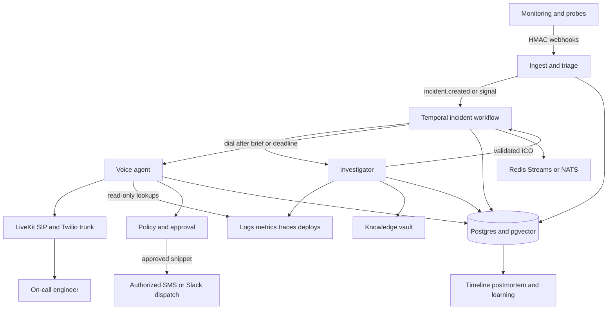

# On-call Voice — Architecture

> Status: Normative system architecture  
> Last updated: 2026-09-23

## 1. Architectural drivers

The design optimizes for:

1. Grounded diagnosis before conversational polish.
2. A useful pre-call brief within 60 seconds.
3. Sub-second perceived conversational turns.
4. Deterministic control of mutating operations.
5. Survival across worker crashes, retries, and provider callbacks.
6. Complete provenance and auditability.
7. Replaceable providers behind stable internal contracts.
8. Isolation from the monitored system's primary failure domain.

When trade-offs conflict, safety and grounding outrank latency; latency outranks stylistic richness; provider convenience ranks last.

## 2. System context



The diagram represents logical boundaries. Provider choices are adapters, not domain dependencies.

## 3. Seven planes and ownership

| Plane | Owns | Must not own |
| --- | --- | --- |
| Signal | Detection and source-specific alert delivery | Incident grouping or voice policy |
| Ingest and triage | Signature verification, normalization, fingerprint, dedupe, grouping, severity | Long investigation or conversation |
| Orchestration | Durable incident lifecycle, timers, retries, escalation, cancellation | Non-deterministic network side effects inside workflows |
| Investigator | Evidence collection, retrieval, hypothesis, Incident Context Object | Calling, approval, mutation |
| Voice | Streaming conversation, turn handling, concise grounded speech | Heavy investigation or policy classification |
| Action and approval | Tiering, canonical command, consent FSM, signed record, dispatch | Free-form model authorization |
| Memory and learning | Timeline, evaluation artifacts, postmortem draft, gap detection | Silently promoting model output into verified runbooks |

## 4. Repository topology

```text
oncall-voice/
├── apps/
│   ├── gateway/          # FastAPI webhooks, normalization, triage API
│   ├── orchestrator/     # Temporal workflows and activities
│   ├── investigator/     # Evidence graph, tool adapters, RAG, ICO builder
│   ├── voice/            # LiveKit worker, streaming pipeline, dialog FSM
│   └── console/          # Incident, transcript, audit, and policy UI
├── packages/
│   ├── contracts/        # Pydantic domain and wire contracts
│   ├── domain/           # Pure incident, evidence, approval logic
│   ├── policy/           # OPA/Cedar policy, command catalog, evaluator
│   ├── knowledge/        # Ingestion, chunking, retrieval, reranking, eval
│   ├── observability/    # Logging, traces, metrics, redaction
│   └── providers/        # Ports and provider-specific adapters
├── labs/
│   └── broken-shop/      # FastAPI, Postgres, Redis, faults, load, probes
├── evals/
│   ├── incidents/        # Ground-truth incident fixtures
│   ├── retrieval/        # Queries, relevant chunks, refusal cases
│   ├── voice/            # Synthetic audio and persona scenarios
│   └── rubrics/          # Deterministic and judge-based scoring
├── infra/                # Compose first; Terraform after contracts stabilize
├── migrations/           # Ordered database migrations
└── .context/             # Permanent operating and architecture context
```

Dependency direction is inward: applications and adapters may import domain/contracts; domain/contracts never import provider SDKs.

## 5. Deployment topology and failure domains

### Local development

- Docker Compose: Postgres + pgvector, Redis or NATS, Temporal dev server, broken-shop, Prometheus, optional Grafana.
- Provider adapters default to deterministic fakes.
- Voice can use file/audio-loopback mode before PSTN.

### Staging

- Responder runs in a region near the SIP point of presence.
- Broken-shop and staging monitoring run in an isolated account/project.
- Calls are restricted to allowlisted test numbers.
- Mutation adapter remains deny-all.

### Production

- Gateway, workflow workers, and datastore run outside the monitored application's primary region/account where feasible.
- Postgres uses encryption, point-in-time recovery, and restricted roles.
- Temporal Cloud or an equivalently durable deployment hosts one workflow per incident.
- Voice workers scale independently and use region-aware routing.
- Global kill switches are stored in a highly available control plane and cached only with short, fail-closed TTLs.

## 6. Primary event flow

```mermaid
sequenceDiagram
    participant M as Monitor
    participant G as Gateway
    participant D as Postgres
    participant T as Temporal
    participant I as Investigator
    participant V as Voice
    participant E as Engineer

    M->>G: signed alert + idempotency key
    G->>G: verify, normalize, fingerprint, severity
    G->>D: upsert alert and grouped incident
    G->>T: start/signal workflow using incident ID
    par bounded evidence collection
        T->>I: investigate(deadline)
        I->>I: logs, metrics, traces, deploys, retrieval
        I->>D: evidence and validated ICO
    and escalation preparation
        T->>T: resolve roster and enforce gates
    end
    T->>V: dial with compact ICO
    V->>E: consent + two-sentence brief
    E->>V: follow-up question
    V->>V: retrieve bounded context, generate, validate
    V->>E: observed/retrieved/inferred answer
    E->>V: asks for action
    V->>V: policy + approval FSM
    V->>E: command, blast radius, reversibility, source
    E->>V: exact GO
    V->>D: signed approval record
    V->>E: dispatch confirmation; no autonomous mutation
```

## 7. Ingest and triage design

### Request boundary

Every source adapter converts a provider payload into `NormalizedAlert` only after:

- Validating HMAC/signature and timestamp tolerance.
- Enforcing body-size and content-type limits.
- Rejecting replayed delivery IDs.
- Recording source, received time, and payload digest.
- Storing raw payload encrypted when retention policy permits.

### Fingerprinting

Fingerprint fields are provider-specific but normalize to:

```text
hash(source_namespace, environment, service, alert_rule, stable_dimensions)
```

Exclude volatile values such as timestamps, request IDs, and full error messages. Store fingerprint version so algorithms can evolve without silent regrouping.

### Grouping and dedupe

- Alert delivery ID gives exact idempotency.
- Fingerprint plus configurable time window groups related alerts.
- Correlation rules may merge fingerprints only through explicit, tested policies.
- Updates signal the existing workflow; they do not start another call automatically.

### Severity decision

A deterministic ruleset selects:

- `voice_page`
- `message_only`
- `suppress`

Inputs include source severity, affected service tier, SLO burn, environment, confidence, maintenance window, flapping state, and quiet-hours policy. The model does not assign paging behavior.

## 8. Durable incident workflow

### Workflow identity

`incident/<incident_id>` is the stable Temporal workflow ID. Starting the same ID is idempotent; later alerts signal the existing workflow.

### Workflow state

```text
NEW → TRIAGED → INVESTIGATING → BRIEF_READY|BRIEF_PARTIAL
    → DIALING → CONNECTED|RETRY_WAIT|ESCALATING
    → ACKNOWLEDGED → MONITORING → RESOLVED|CLOSED

Any nonterminal state may enter SUPPRESSED or CANCELLED by policy.
```

### Determinism rules

- Workflow code contains decisions, timers, and state only.
- Network I/O, database I/O, provider calls, randomness, and current time are activities or workflow-safe APIs.
- Activity inputs carry idempotency keys.
- Retry policies distinguish transient errors, permanent policy denials, and deadline exhaustion.
- Continue-as-new prevents unbounded history on long incidents.

### Investigation deadline behavior

At the configured deadline, the workflow uses the best validated partial ICO. If no safe brief exists, it may call with a transparent “investigation incomplete” message for SEV1 or fall back to message-only according to policy. It never waits indefinitely.

## 9. Investigator architecture

### Evidence acquisition

The investigator fans out bounded read-only tasks:

- Recent logs around the incident window.
- SLI/SLO and component metrics.
- Representative traces.
- Deploys, feature flags, and diffs.
- Database and queue health.
- Service ownership and dependency metadata.
- Similar resolved incidents.
- Hybrid runbook retrieval.

Each tool has:

- Strict input/output Pydantic schemas.
- A source ID and observation timestamp.
- Per-call timeout and result-size limit.
- Read-only policy classification.
- Redaction and prompt-injection neutralization.
- Error-as-data behavior so one failure does not erase the brief.

### Investigator stages

1. Normalize the incident question and time window.
2. Start independent evidence calls concurrently.
3. Convert results into typed `EvidenceItem` values.
4. Build an evidence timeline and detect deploy/signal correlations.
5. Query runbooks lexically and semantically.
6. Fuse ranks using RRF, rerank top candidates, then enforce eligibility.
7. Generate candidate hypotheses with supporting and contradicting evidence.
8. Validate source references and confidence bounds.
9. Produce the ICO under the token and deadline budget.
10. Persist exact inputs, outputs, model/provider metadata, and validation result.

### Hypothesis rules

- A hypothesis is never promoted to observed fact.
- `grounded_in` contains valid evidence IDs only.
- Contradicting evidence and unknowns are retained.
- Confidence is calibrated against the canonical fault set; it is not decorative precision.
- The voice opening describes the hypothesis as a best-supported explanation, not “the root cause,” until verified.

## 10. Incident Context Object

The ICO is the only rich artifact passed from slow brain to fast brain. Target: fewer than 2,000 model tokens.

```json
{
  "schema_version": "1.0",
  "incident_id": "INC-000204",
  "generated_at": "2026-09-23T09:28:00Z",
  "investigation_status": "complete",
  "headline": "Checkout API returning 500s since 02:58 UTC",
  "impact": "About 94% of checkout requests are failing; estimated 40 users affected",
  "severity": "SEV1",
  "service": "checkout-api",
  "signals": [
    {
      "source_id": "metric:error-rate:8820",
      "class": "observed",
      "type": "metric",
      "observed_at": "2026-09-23T02:58:00Z",
      "text": "Error rate increased from 0.2% to 94%"
    },
    {
      "source_id": "log:8821",
      "class": "observed",
      "type": "log",
      "observed_at": "2026-09-23T02:58:04Z",
      "text": "Postgres reported remaining connection slots reserved"
    },
    {
      "source_id": "deploy:v2.14.1",
      "class": "observed",
      "type": "deploy",
      "observed_at": "2026-09-23T02:51:00Z",
      "text": "checkout-api v2.14.1 deployed"
    }
  ],
  "hypothesis": {
    "text": "Connection-pool exhaustion introduced by v2.14.1",
    "confidence": 0.72,
    "grounded_in": ["log:8821", "deploy:v2.14.1"],
    "contradicted_by": []
  },
  "candidate_runbooks": [
    {
      "chunk_id": "DB-07#step-3",
      "title": "Postgres connection exhaustion",
      "owner": "database-platform",
      "last_verified": "2026-03-14",
      "eligibility": "eligible",
      "score": 0.91
    }
  ],
  "similar_past_incidents": [
    {"incident_id": "INC-000173", "resolution_summary": "Human rolled back release"}
  ],
  "unknowns": ["No trace data is available for the 02:51–02:58 window"],
  "tool_errors": [],
  "expires_at": "2026-09-23T10:28:00Z"
}
```

### ICO validation

Reject or downgrade an ICO when:

- A referenced source ID does not exist.
- A candidate runbook lacks owner or verification date.
- Text includes a command not represented by an eligible runbook step.
- Token/size budget is exceeded.
- Timestamps are outside the incident window without explanation.
- Confidence is outside `[0, 1]`.
- Required fields are absent.

## 11. Knowledge vault and retrieval

### Ingestion

Sources may include Notion, Markdown, or Confluence, but adapters must preserve:

- Source URL and ACL metadata.
- Runbook ID and title.
- Service and tags.
- Owner.
- Heading path.
- Step/procedure boundary.
- `last_verified_at` and supersession state.
- Content digest and ingestion time.

Chunks should represent one coherent procedure or decision unit. Do not split commands from prerequisites, warnings, blast radius, or rollback instructions.

### Retrieval pipeline

1. Normalize the query without removing exact technical identifiers.
2. PostgreSQL full-text search retrieves exact/lexical candidates.
3. pgvector retrieves semantic candidates.
4. Reciprocal rank fusion combines ranks; do not average incomparable raw scores.
5. Reranker scores the fused top set.
6. Eligibility filter removes stale, inaccessible, ownerless, superseded, or unverified chunks.
7. Return top candidates with score components and provenance.

Use Qdrant only when measured corpus scale or query performance justifies a separate vector store.

### Retrieval release gates

- Curated queries include exact identifiers such as `OOMKilled` and `pg_stat_activity`.
- Measure recall@k, MRR, stale-chunk rejection, and refusal precision.
- Voice integration is blocked until retrieval gates in `project-overview.md` pass.

## 12. Voice architecture

### First production mode

Use a cascaded pipeline:

```text
PSTN/SIP audio
  → LiveKit room
  → noise cancellation
  → Silero VAD + semantic turn detector
  → streaming Deepgram STT
  → fast text LLM with ICO and bounded tools
  → grounding/claim validator
  → streaming Cartesia or Deepgram TTS
  → PSTN/SIP audio
```

Speech-to-speech may be explored later behind a feature flag, but cannot bypass text inspection or approval controls.

### Latency budget

| Stage | Target |
| --- | ---: |
| SIP/RTP and network | 50–120 ms |
| End-of-turn detection | 200–400 ms |
| STT finalization | 80–150 ms |
| LLM time to first token | 250–450 ms |
| TTS time to first byte | 80–150 ms |
| Perceived response | p50 ≤800 ms; p95 <1 s |

Budgets overlap through streaming. The system starts TTS on a validated first sentence while later text is still generated. It caps normal spoken responses at roughly two sentences and offers more detail.

### Hot-path tools

Allowed hot-path tools are narrow read-only operations with a target below 1.5 seconds, such as refreshing one metric or checking current deployment status. Every tool has a timeout and a natural filler path. Slow operations become asynchronous and cannot stall turn handling.

### Grounding validator

Before TTS, the validator checks:

- Every factual clause has a valid evidence or runbook reference, or is explicitly labeled inference.
- Procedural language originates from an eligible runbook chunk.
- No prohibited secrets, raw identifiers, or unsafe command variants are spoken.
- Staleness and unknowns are surfaced.

On failure, use a deterministic refusal template rather than regenerating indefinitely.

## 13. Dialog and approval state machine

```text
GREETING
  → CONSENT_ANNOUNCED
  → BRIEFING
  → Q_AND_A
  → ACTION_PROPOSED
  → AWAITING_GO
  → READBACK_REQUIRED? ──yes──> AWAITING_SECOND_CONFIRMATION
  → APPROVED
  → AUDIT_WRITTEN
  → DISPATCHED
  → RECOVERY_MONITORING
  → RESOLVED_OR_HANDOFF
```

Rules:

- Approval input is considered only in `AWAITING_GO` or `AWAITING_SECOND_CONFIRMATION`.
- Initial exact keyword is `GO`, configurable only by reviewed policy.
- Casual assent, partial transcripts, low-confidence STT, DTMF noise, or a keyword spoken in another context does not approve.
- The canonical command displayed, spoken, signed, and dispatched must have the same digest.
- Any command edit resets approval.
- Caller identity confidence and authorization are policy inputs.
- If the call drops before the audit record is committed, approval is invalid.
- MVP terminates at dispatch; there is no mutation executor.

## 14. Policy engine

OPA/Rego is the default policy implementation; Cedar is an acceptable alternative if identity/resource authorization becomes dominant.

Policy input includes:

- Tool and operation.
- Canonical command digest.
- Environment and service.
- Caller identity and role.
- Runbook chunk and eligibility.
- Blast radius and reversibility.
- Incident severity and state.
- Requested execution mode.

Policy output is a typed decision:

```json
{
  "decision": "allow_read_only | require_approval | deny",
  "tier": 1,
  "reason_codes": ["PROVEN_READ_ONLY"],
  "requires_second_confirmation": false,
  "max_scope": {"service": "checkout-api", "environment": "prod"},
  "policy_version": "2026-09-23.1"
}
```

Unknown operations are Tier 2 and denied by default.

## 15. Persistence model

Core tables:

```sql
CREATE TABLE incidents (
  id uuid PRIMARY KEY,
  fingerprint text NOT NULL,
  fingerprint_version integer NOT NULL,
  severity text NOT NULL,
  status text NOT NULL,
  service text NOT NULL,
  opened_at timestamptz NOT NULL,
  acknowledged_at timestamptz,
  resolved_at timestamptz,
  summary text,
  root_cause_hypothesis text,
  UNIQUE (fingerprint, fingerprint_version, opened_at)
);

CREATE TABLE alerts (
  id uuid PRIMARY KEY,
  incident_id uuid NOT NULL REFERENCES incidents(id),
  source text NOT NULL,
  delivery_id text NOT NULL,
  raw_payload_encrypted bytea,
  payload_digest text NOT NULL,
  received_at timestamptz NOT NULL,
  UNIQUE (source, delivery_id)
);

CREATE TABLE incident_contexts (
  id uuid PRIMARY KEY,
  incident_id uuid NOT NULL REFERENCES incidents(id),
  schema_version text NOT NULL,
  brief jsonb NOT NULL,
  evidence jsonb NOT NULL,
  retrieved_chunk_ids text[] NOT NULL,
  model text NOT NULL,
  validation_status text NOT NULL,
  created_at timestamptz NOT NULL
);

CREATE TABLE calls (
  id uuid PRIMARY KEY,
  incident_id uuid NOT NULL REFERENCES incidents(id),
  destination_ciphertext bytea NOT NULL,
  started_at timestamptz,
  ended_at timestamptz,
  outcome text,
  recording_url_ciphertext bytea,
  transcript jsonb,
  latency_p50_ms integer,
  latency_p95_ms integer,
  provider_call_id text UNIQUE
);

CREATE TABLE runbooks (
  id text PRIMARY KEY,
  title text NOT NULL,
  service text NOT NULL,
  tags text[] NOT NULL,
  source_url text NOT NULL,
  owner text NOT NULL,
  last_verified_at timestamptz NOT NULL,
  superseded_at timestamptz
);

CREATE TABLE runbook_chunks (
  id text PRIMARY KEY,
  runbook_id text NOT NULL REFERENCES runbooks(id),
  heading_path text[] NOT NULL,
  content text NOT NULL,
  token_count integer NOT NULL,
  content_digest text NOT NULL,
  embedding vector(768),
  fts tsvector NOT NULL
);

CREATE TABLE approvals (
  id uuid PRIMARY KEY,
  incident_id uuid NOT NULL REFERENCES incidents(id),
  call_id uuid NOT NULL REFERENCES calls(id),
  command text NOT NULL,
  command_digest text NOT NULL,
  tier integer NOT NULL,
  runbook_chunk_id text NOT NULL REFERENCES runbook_chunks(id),
  transcript_span jsonb NOT NULL,
  approved_by text NOT NULL,
  approved_at timestamptz NOT NULL,
  policy_version text NOT NULL,
  signature bytea NOT NULL
);

CREATE TABLE audit_log (
  sequence_id bigserial PRIMARY KEY,
  incident_id uuid NOT NULL REFERENCES incidents(id),
  actor text NOT NULL,
  action text NOT NULL,
  payload jsonb NOT NULL,
  occurred_at timestamptz NOT NULL,
  previous_digest text,
  digest text NOT NULL UNIQUE
);
```

Migrations may refine types and indexes, but must preserve the audit and provenance fields.

## 16. Escalation and call reliability

Default ladder, made environment-configurable:

1. Dial primary.
2. If no answer or AMD identifies voicemail, wait 90 seconds.
3. Redial primary, at most twice total unless policy says otherwise.
4. Send message/push and dial secondary.
5. Dial escalation contact and post the full brief to the incident channel.

Guardrails:

- Per-incident and global calls-per-hour caps.
- Severity gate: quiet unless policy says voice-worthy.
- Kill switch checked before every dial activity.
- Provider callback idempotency.
- Voicemail does not acknowledge the incident.
- Call outcome and escalation decision are durable events.
- If all voice providers fail, send the compact brief through approved channels.

## 17. Recovery monitoring

A dispatched action is not considered successful because it was sent or because the caller said it ran. Recovery requires objective signals such as:

- Error rate falls below threshold for a hold period.
- Latency/SLO burn recovers.
- Health checks pass.
- Queue/backlog trends improve.
- Deployment state matches the intended target.

The system reports “recovery observed,” “no recovery observed,” or “insufficient telemetry,” never unsupported success.

## 18. Security and threat model

### Primary threats

- Forged or replayed alerts.
- Prompt injection through logs, traces, runbooks, tickets, or transcripts.
- Tool escalation from read-only to mutation.
- STT false approval.
- Unauthorized caller or forwarded call.
- Duplicate side effects from retries.
- Secret/PII leakage in prompts, logs, recordings, or traces.
- Stale runbook used as current procedure.
- Compromised provider callback.
- Audit record tampering.
- Runaway dial loop or spend.

### Controls

- HMAC/signature verification, timestamp windows, payload digests, and idempotency.
- Typed data boundaries and explicit untrusted-data delimiters.
- Least-privilege service accounts and separate read-only credentials.
- OPA/Cedar default deny and command allowlists.
- Exact approval FSM with transcript confidence and caller authorization.
- Encryption in transit/at rest and field-level protection for phone/recording data.
- Append-only digest-chained audit log and signed approval records.
- Runbook owner/freshness/ACL checks.
- Callback signature verification.
- Rate limits, spend limits, and kill switches.

## 19. Observability

Use OpenTelemetry end to end. Correlation keys include:

- `incident_id`
- `alert_id`
- `workflow_id`
- `investigation_id`
- `call_id`
- `turn_id`
- `tool_call_id`
- `runbook_chunk_id`
- `policy_version`

Required metrics:

- Alert accept/reject/dedupe counts.
- Incidents by severity and decision.
- Investigation duration, timeouts, tool failures, and partial rate.
- Retrieval recall/eval metrics and stale rejection.
- Voice stage latency, interruption latency, drop rate, and AMD outcome.
- Grounding validator pass/refusal rates.
- Approval attempts, rejections, and audit completeness.
- Calls/spend per incident and global.
- Workflow retries, replay failures, and escalation outcomes.

Traces may store model metadata and token counts but must redact sensitive prompt content according to policy.

## 20. Failure behavior

| Failure | Required behavior |
| --- | --- |
| One telemetry provider times out | Continue with partial evidence and name the gap. |
| All investigation tools fail | Do not invent a cause; page with detection facts or message-only per severity policy. |
| Retrieval is low confidence | Refuse procedure and describe observations only. |
| Voice LLM fails | Read a deterministic compact brief and escalation instructions. |
| TTS fails | Send the brief through approved text channels and escalate. |
| STT confidence is low during approval | Ask for exact repetition; never approve. |
| Temporal worker dies | Another worker resumes from durable history. |
| Postgres unavailable | Buffer only within defined limits; fail closed for approval and audit. |
| Policy engine unavailable | Deny Tier 2; Tier 1 behavior follows cached signed policy only if explicitly allowed. |
| Audit write fails | Do not dispatch or execute. |
| Kill switch state is unavailable | Fail closed: no call and no mutation. |

## 21. Architectural decision records

Create a full ADR when changing any item below. Current decisions:

| ID | Decision | Status |
| --- | --- | --- |
| ADR-001 | Two-stage Investigator then Voice architecture | Accepted |
| ADR-002 | Cascaded STT → text LLM → TTS for first production mode | Accepted |
| ADR-003 | Temporal owns one durable workflow per incident | Accepted |
| ADR-004 | Postgres + pgvector is the initial system of record and vector store | Accepted |
| ADR-005 | Hybrid FTS + vector retrieval, RRF, then reranking | Accepted |
| ADR-006 | OPA/Rego default policy engine; unknown actions deny | Accepted |
| ADR-007 | MVP dispatches approved snippets; no Tier 2 executor | Accepted |
| ADR-008 | Voice integration waits for investigation and retrieval quality gates | Accepted |
| ADR-009 | Provider SDKs stay behind internal ports | Accepted |
| ADR-010 | Responder deploys outside the monitored primary failure domain | Accepted |

## 22. Architecture change checklist

Before accepting an architectural change:

- Does it preserve the two-clock model?
- Does it weaken grounding, refusal, or runbook eligibility?
- Can it introduce a mutation outside the approval FSM?
- Is its state durable and its side effect idempotent?
- What is its timeout and fallback?
- What new sensitive data does it create or expose?
- Does it add latency to the hot path?
- Is the provider replaceable through a stable contract?
- Can `labs/broken-shop` and eval fixtures prove the behavior?
- Is an ADR and progress-tracker update included?